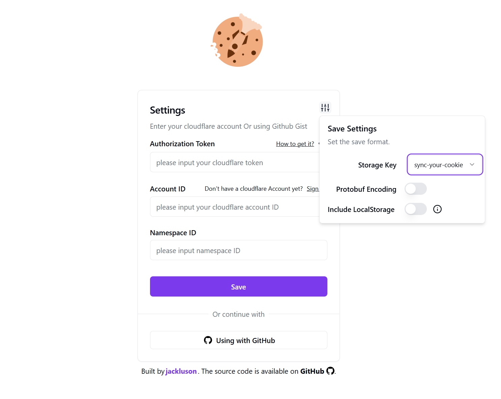
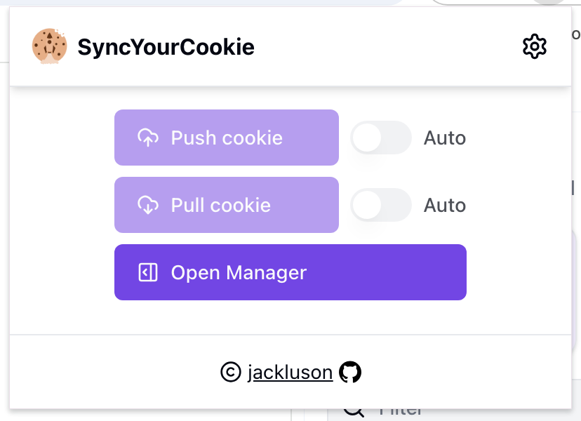
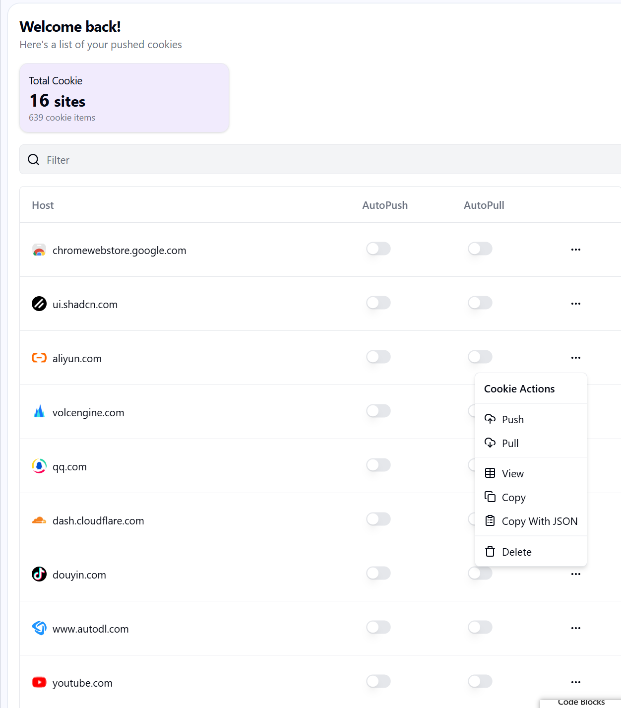
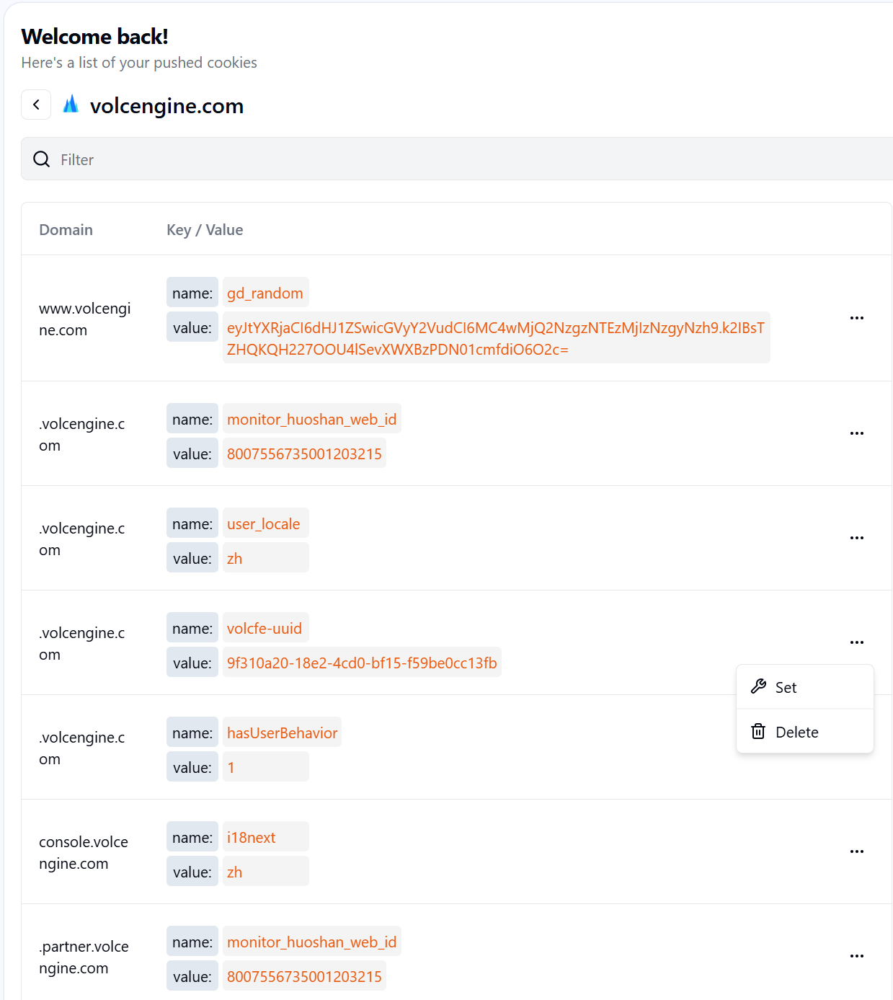
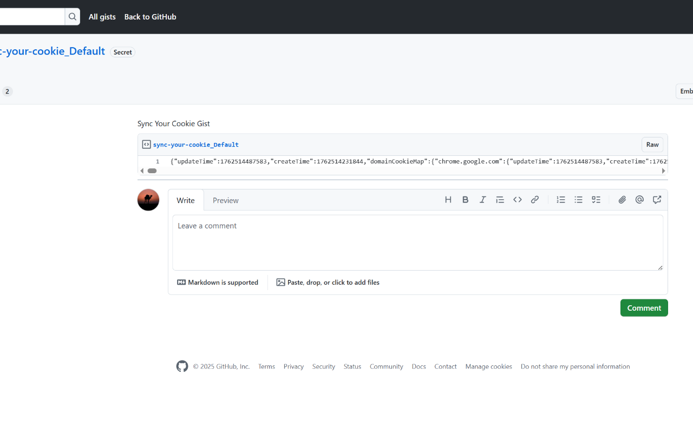
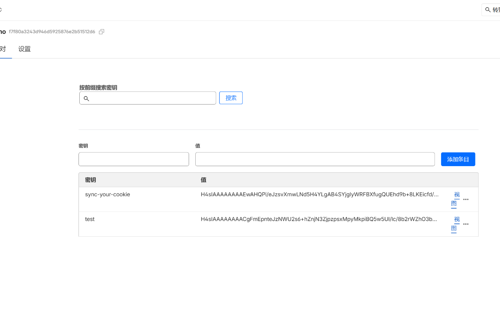

<h1> Sync your cookie to Your Cloudflare or Github Gist</h1>

<!--  -->

[English](./README.md) | [中文](./README_ZH.md)

`Sync your cookie` is a chrome extension that helps you to sync your cookie to Cloudflare or Github Gist. It's a useful tool for web developers to share cookies between different devices. 

### Install
[Sync Your Cookie](https://chromewebstore.google.com/detail/sync-your-cookie/bcegpckmgklcpcapnbigfdadedcneopf)

### Features

- Supports syncing cookies to Cloudflare or Github Gist (Include LocalStorage)
- Supports configuring `Auto Merge` and `Auto Push` rules for different sites
- Cookie data is transmitted via protobuf encoding
- Provides a management panel to facilitate viewing, copying, and managing synchronized cookie data
- Multi-account synchronization based on Storage-key

### Project Screenshots

Account Settings Page

Cookie Sync Popup Page

Cookie Manager Sidebar Panel

Cookie Detail

Pushed Cookie on Github Gist

Pushed Cookie on Cloudflare

### Usage

[How to use](./how-to-use.md)

### TODO

- [x] Custom Store Configure
- [x] Multi-account synchronization based on Storage-key
- [x] Sync LocalStorage
- [x] More Cloud Platform (First github gist)

### Privacy Policy

Please refer to [Privacy Policy](./private-policy.md) for more information.
