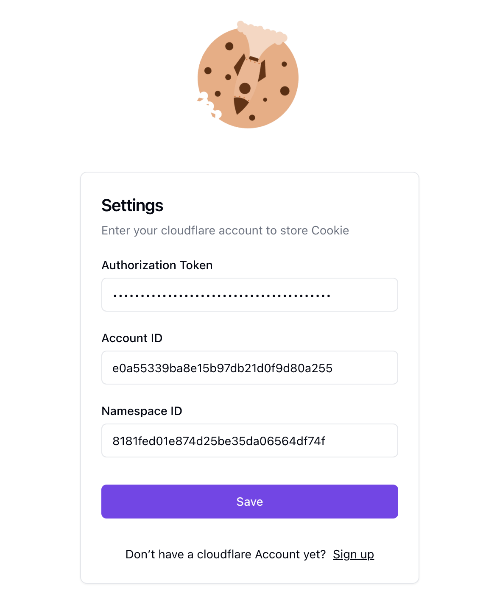

<h1> Sync your cookie to  Cloudflare</h1>

[English](./README.md) | [中文](./README_ZH.md)

`Sync your cookie` 是一个 Chrome 扩展程序，它可以帮助您将 Cookie 同步到 Cloudflare。它是一个有用的工具，用于在不同设备之间共享 Cookie, 免去了登录流程的烦恼，此外也提供了cookie管理面板查看，管理已经过同步的 cookie。

<!-- // 使用gif展示功能 -->

### 功能
- 支持同步 Cookie 到 Cloudflare
- 支持为不同站点配置`Auto Merge`和`Auto Push`规则
- Cookie数据经过 protobuf 编码传输
- 提供了一个管理面板，方便查看、复制、管理已经同步的 Cookie 数据

### 项目截图

账号设置页面

Cookie 同步页面

Cookie 管理侧边栏面板

Cookie 详情

### 使用指引

[How to use](./how-to-use.md)

### Privacy Policy

Please refer to [Privacy Policy](./private-policy.md) for more information.

