## How to use
`Sync-Your-Cookie` uses Cloudflare [KV](https://developers.cloudflare.com/kv/) to store cookie data. Here is a tutorial on how to configure KV and Token:

## Create Namespace

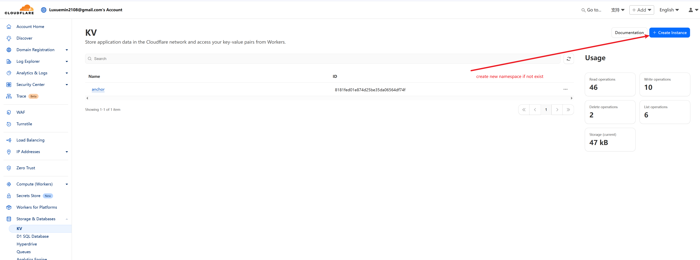

Input
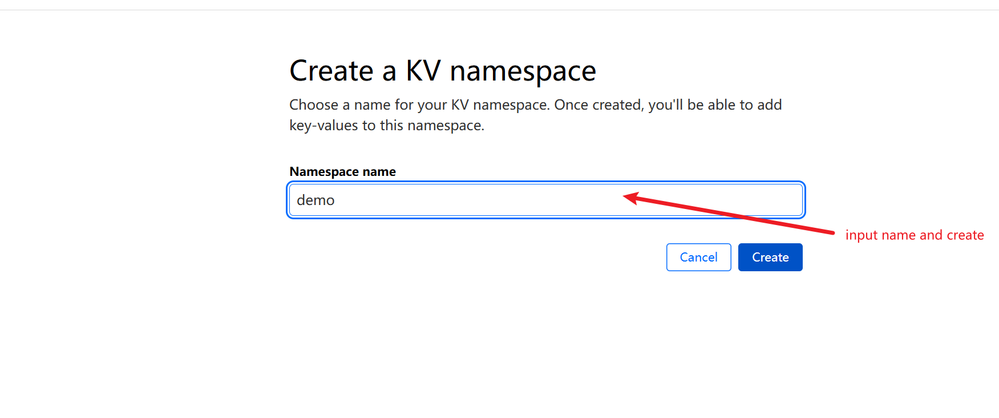

Your NamespaceId
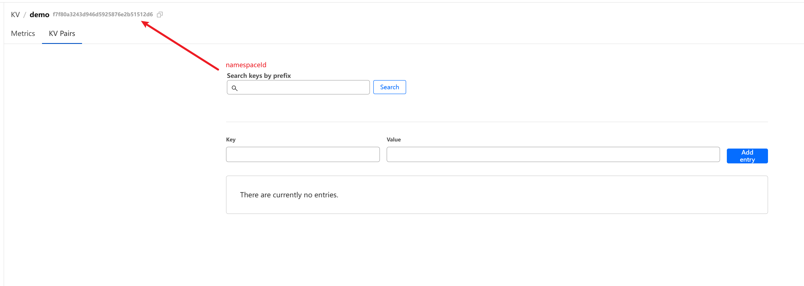

## Your AccountId

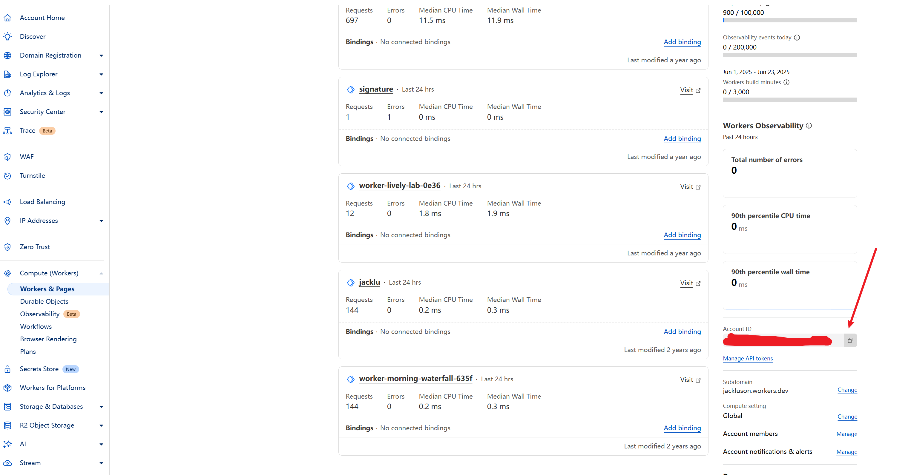

## Create Token

1. Enter Profile Page

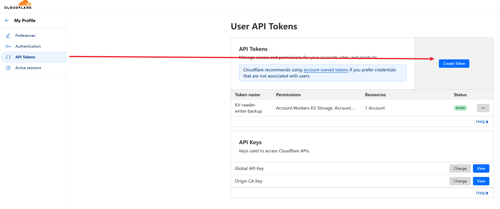

2. Custom Permission

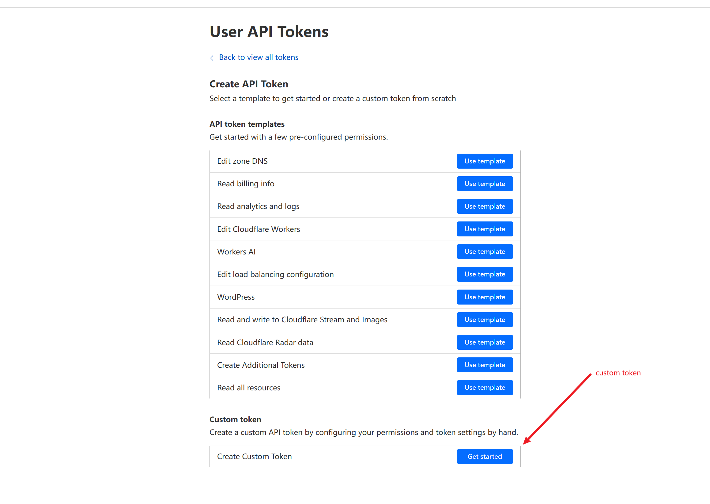

3. Select KV Read and Write Permission

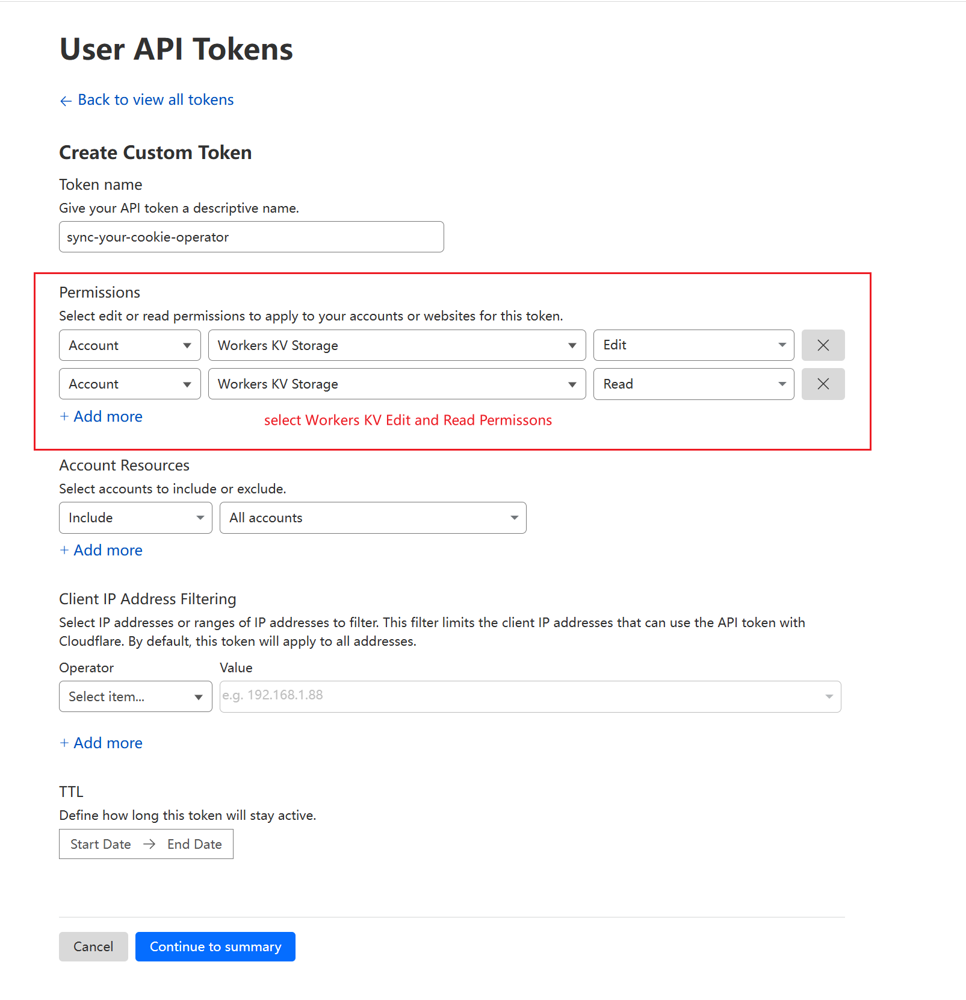

4. Confirm Create

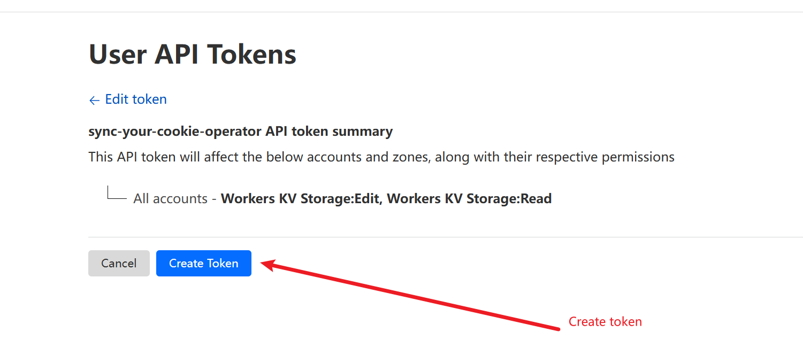

5. Copy Token

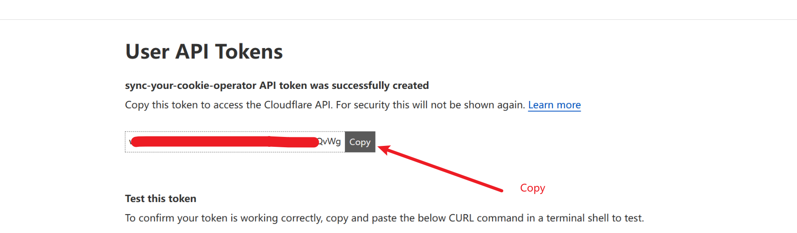

6. Your Token List

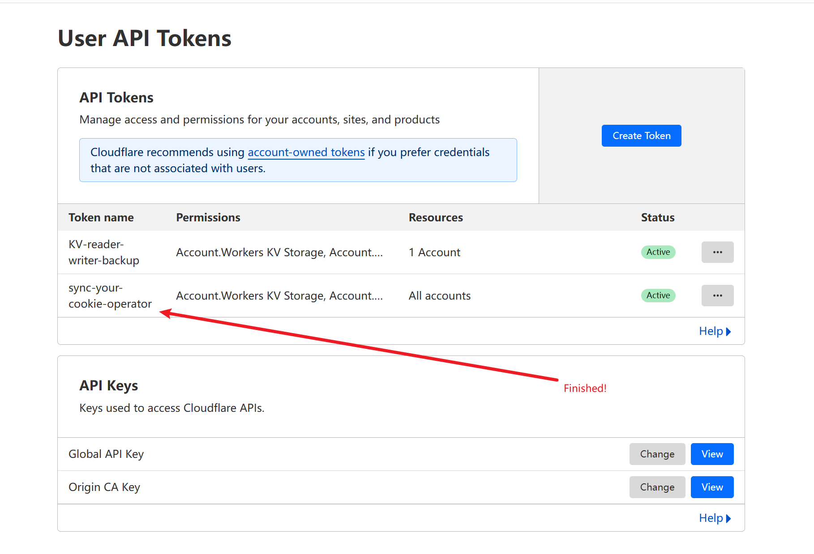

7. Paste Your Account Info And Save

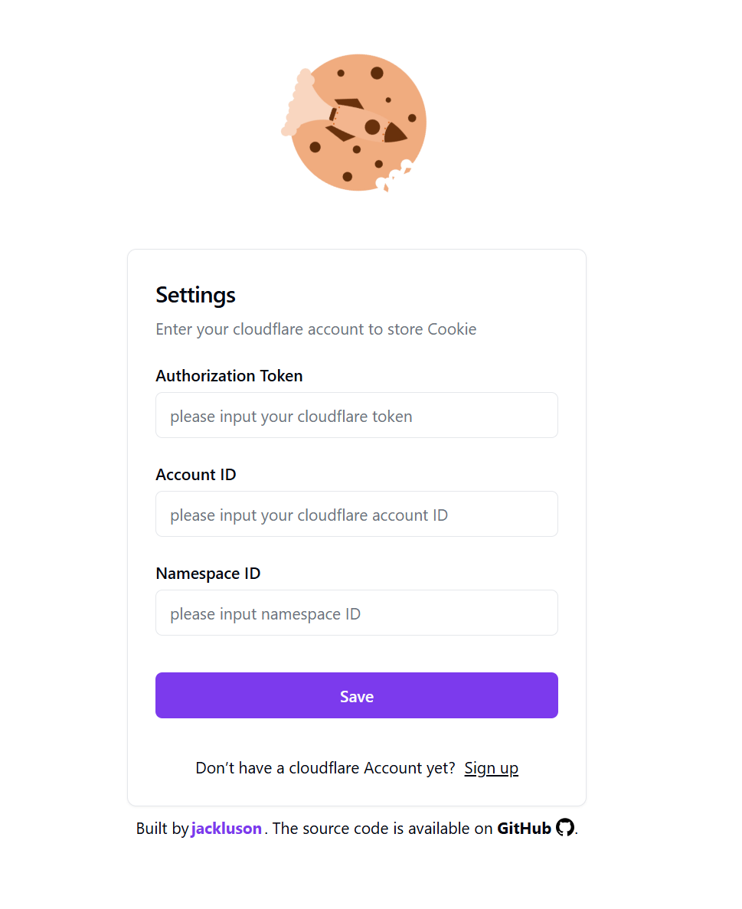

8. Push Your Cookie

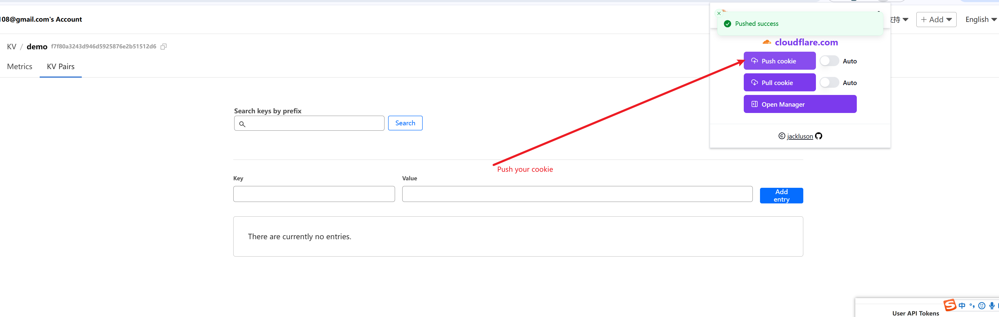

9. Check Your Cookie

The uploaded cookie is a protobuf-encoded string
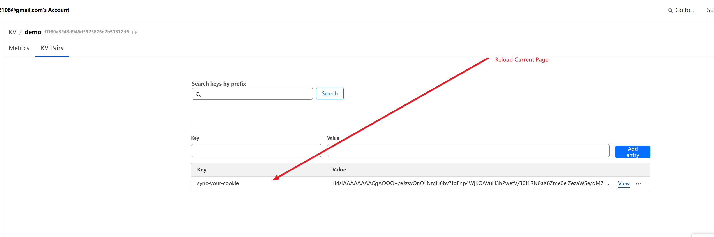

